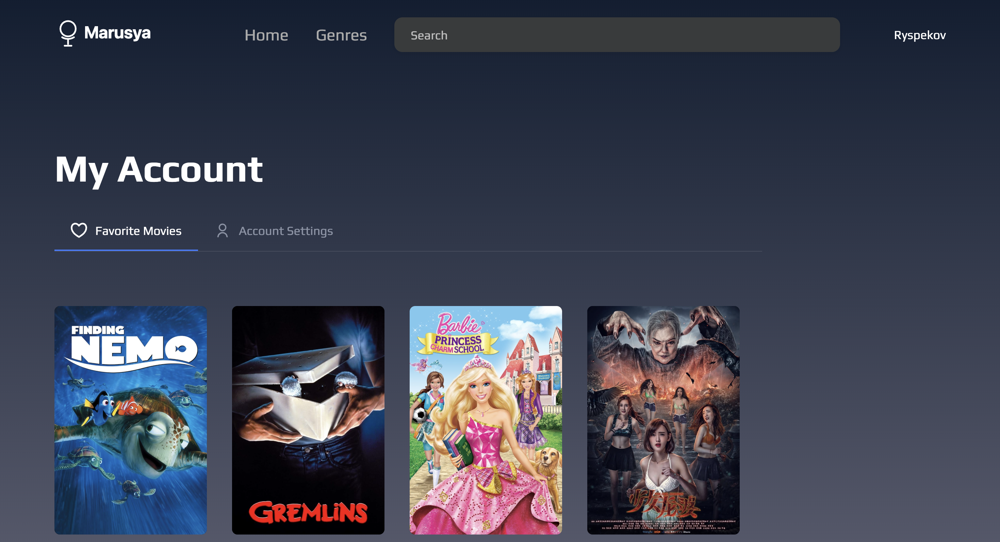
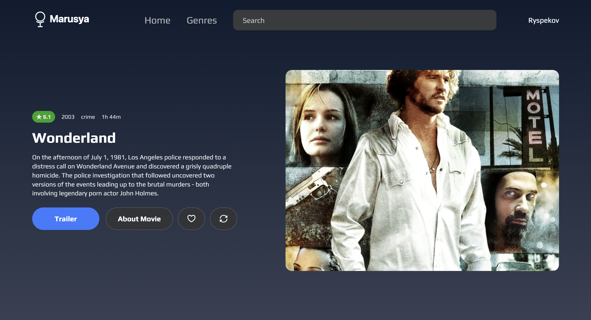

# Cinema Guide (Marusya)

A modern and elegant movie discovery web application built with React, TypeScript, and Vite. Discover new movies, explore different genres, and manage your personal favorites collection with a sleek dark interface.






## ✨ Features

- 🎬 **Random Movie Showcase** - Discover new movies with featured hero section
- 🔍 **Smart Search** - Real-time movie search with autocomplete suggestions
- 🎭 **Genre Filtering** - Browse movies by categories and genres
- ❤️ **Favorites System** - Save and manage your favorite movies
- 👤 **User Authentication** - Secure login and registration
- 🎥 **Movie Trailers** - Watch trailers directly in the app
- 📊 **Detailed Movie Info** - Comprehensive information, ratings, and cast details
- 📱 **Responsive Design** - Optimized for desktop, tablet, and mobile

## 🛠️ Tech Stack

- **Frontend**: React 18 + TypeScript
- **Build Tool**: Vite
- **Styling**: SCSS Modules
- **Routing**: React Router v6
- **State Management**: React Context API
- **HTTP Client**: Axios
- **Notifications**: React Toastify
- **Icons**: SVG React Components

## 📦 Installation

1. **Clone the repository**
   git clone https://github.com/Marat-Vodochka/vite-vk-marusya.git
   cd vite-vk-marusya

2. **Install dependencies**
   npm install

3. **Start development server**
   npm run dev

4. **Open in browser**
   Navigate to [http://localhost:5173](http://localhost:5173)

## 🏗️ Project Structure

src/
├── assets/ # Icons, images, and static files
├── components/ # Reusable UI components
│ ├── Authorization/ # Login/Register forms and user context
│ ├── Header/ # Navigation header with search
│ ├── MovieCard/ # Movie display component
│ ├── SearchModal/ # Search functionality
│ └── ui/ # Basic UI components (Button, Modal, etc.)
├── pages/ # Page components
│ ├── Account/ # User account and favorites
│ ├── Genres/ # Genre listing page
│ ├── Home/ # Homepage with hero section
│ └── Movie/ # Movie details and genre pages
├── services/ # API services and utilities
├── types/ # TypeScript type definitions
├── styles/ # Global styles and SCSS variables
└── App.tsx # Main application component

```

## 🎯 Available Scripts

# Development
npm run dev          # Start development server
npm run build        # Build for production
npm run preview      # Preview production build

# Code Quality
npm run lint         # Run ESLint
npm run type-check   # TypeScript type checking

## 🎨 Key Features

### Hero Section

- Random movie showcase with backdrop image
- Movie details (rating, year, genres, duration)
- Quick actions: trailer, favorites, movie details
- Refresh button for new random movie

### Search System

- Real-time search with live suggestions
- Movie cards with posters and ratings
- Direct navigation to movie details
- Mobile-optimized search modal

### User Authentication

- Login and registration forms
- Protected routes for favorites
- Persistent user sessions
- User profile management

### Movie Management

- Add/remove from favorites
- Movie details with full information
- Genre-based browsing
- Responsive movie grids

## 🌟 Design Highlights

- **Dark Theme**: Modern dark UI with purple accent colors
- **Responsive Grid**: Adaptive layouts for all screen sizes
- **Smooth Animations**: Hover effects and page transitions
- **Loading States**: Skeleton loaders and progress indicators
- **Error Handling**: User-friendly error messages and fallbacks

## 🚀 Deployment

### Vercel (Recommended)

# Deploy to Vercel
npm install -g vercel
vercel --prod

### Netlify

# Build command: npm run build
# Publish directory: dist


### Manual Deployment

npm run build
# Upload dist/ folder to your hosting provider

## 📝 License

This project is licensed under the MIT License - see the [LICENSE](LICENSE) file for details.

## 🙏 Acknowledgments

- Movie data provided by [Skillbox Cinema API](https://cinemaguide.skillbox.cc)
- Design inspiration from modern streaming platforms
- Icons and assets from various open-source libraries

---

## 📧 Contact

**Marat Ryspekov**

- **GitHub**: [@Marat-Vodochka](https://github.com/Marat-Vodochka)
- **LinkedIn**: [Marat Ryspekov](https://linkedin.com/in/marat-ryspekov)

---

⭐ **If you like this project, please give it a star on GitHub!**

**Project Link**: [https://github.com/Marat-Vodochka/vite-vk-marusya](https://github.com/Marat-Vodochka/vite-vk-marusya)
```
